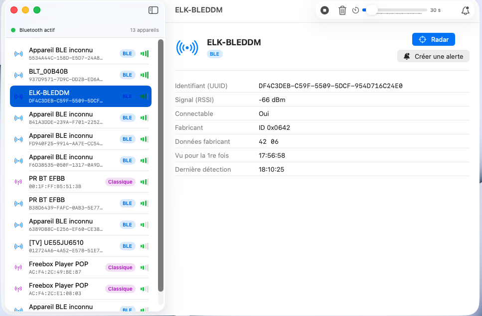
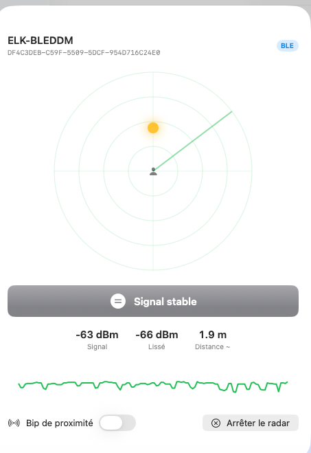

# Bluetooth Radar

App macOS (SwiftUI) qui détecte les appareils Bluetooth **à portée** (sans être connectés),
affiche leur détail, déclenche une **alerte visuelle + sonore** quand une adresse surveillée
apparaît, et propose un **mode radar** pour savoir si l'on se **rapproche** d'un appareil.

> ⚠️ **Pré-version (unstable / v1.0)** — fonctionnelle mais peu testée en conditions réelles.
> Signalez les soucis dans les *Issues*.

<p align="center">
  
</p>

## Fonctions
- **Scan hybride** : BLE (CoreBluetooth) + Bluetooth classique (IOBluetooth).
- **Détail par appareil** : adresse, RSSI, fabricant, services, classe d'appareil, horodatage.
- **Alertes** par adresse **MAC**, **UUID** ou **fragment de nom** — visuelles (bannière rouge
  + rebond du Dock) et sonores. **Chargées et actives dès le démarrage.**
- **Mode radar** : suit le signal d'un appareil, indique *« vous vous rapprochez / éloignez »*,
  avec bip de proximité type Geiger (de plus en plus rapide quand on s'approche).
- **Cycle de scan réglable de 10 s à 5 min**.

<p align="center">
  
</p>

## Installation
1. Télécharge **`BluetoothRadar-1.0.dmg`** depuis la page
   [Releases](../../releases).
2. Ouvre le DMG, glisse **Bluetooth Radar** dans **Applications**.
3. Au 1er lancement : **clic droit sur l'app → Ouvrir → Ouvrir** (app signée ad-hoc, non
   notarisée), une seule fois.
4. Accepte la demande d'autorisation **Bluetooth** (sinon le scan reste vide).

Le DMG est **universel** (Mac Intel **et** Apple Silicon).

## Limite importante — adresses MAC sur macOS
- **Bluetooth classique** → vraie **adresse MAC** (fiable pour les alertes).
- **BLE** → macOS ne donne **pas** la MAC, seulement un **UUID** propre à ce Mac (pas
  forcément stable). Pour surveiller un appareil BLE, utilise son **nom** ou son **UUID**
  comme critère d'alerte. Le mode radar fonctionne surtout en BLE (RSSI mis à jour souvent) ;
  en classique, le RSSI est souvent indisponible.

## Compiler depuis les sources
Nécessite les **Command Line Tools** (pas Xcode complet).
```bash
./build.sh              # arm64 (Apple Silicon)
./build.sh --universal  # universel arm64 + x86_64
./make_dmg.sh           # produit build/BluetoothRadar-1.0.dmg
```

## Architecture
| Fichier | Rôle |
|---|---|
| `BLEScanner.swift` | Scan BLE (CoreBluetooth) — UUID, RSSI, services, fabricant |
| `ClassicScanner.swift` | Scan classique (IOBluetooth) — vraie adresse MAC |
| `ScanCoordinator.swift` | Fusion des scanners, cycle de scan, alertes, mode radar |
| `AlertStore.swift` | Critères surveillés, persistance, correspondance |
| `RadarView.swift` | Écran radar de proximité |

## ☕ Offrez-moi un café

Cette application est gratuite et open source. Si elle vous est utile, vous pouvez me remercier
en m'offrant un café — il suffit de scanner ce QR code PayPal. Merci beaucoup ! 🙏

<p align="center">
  
</p>

## Licence

[MIT](LICENSE) © 2026 Arnaud Soulas
